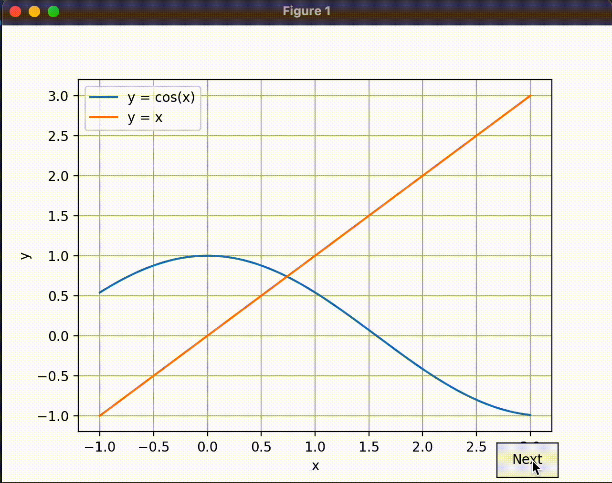

# Numerical Methods

## Numerical Integration
- Composite Midpoint
    - The Composite Midpoint method approximates the definite integral of a function using evenly spaced nodes. It divides the interval into subintervals, calculates midpoints, and approximates the integral by summing the product of the function values at midpoints and subinterval widths.
- Composite Simpsons
    - The Composite Simpson's Rule approximates the definite integral of a function using evenly spaced nodes. It employs quadratic interpolating polynomials to approximate the function in each subinterval and sums these approximations to obtain the integral. An odd number of nodes is required.
- Composite Trapezium
    - The Composite Trapezium Rule approximates the definite integral of a function using evenly spaced nodes. It uses linear interpolating polynomials to approximate the function in each subinterval and sums these linear approximations to obtain the integral. It works well for functions with smooth behavior over the integration interval.
- Romberberg Rules
    - This script demonstrates Composite Trapezium Rule integration with error estimation and endpoint correction. The error estimate uses the function's second derivative and the step size, providing insight into the expected accuracy. Endpoint correction can improve the approximation's accuracy.
- Euler Maclaurin Demonstration
    - Romberg integration combines the trapezoidal rule with Richardson extrapolation to increase accuracy. The script computes the definite integral using Romberg integration and compares the result to the exact integral value. The intermediate results matrix shows the progression of the approximation and the Richardson extrapolation process.

## Solving Equations
- Bisection
    - The Bisection Method finds a root of a continuous function in an interval where the function changes sign. The script defines a function bisection and applies it to two sample functions to find their roots within specified intervals.
 - Fixed Point Iteration
    - The Fixed Point Iteration Method finds a fixed point of a continuous function where g(x) = x. The script defines a function fixed_point_iteration and applies it to two sample functions to find their fixed points, checking for convergence.
- Newtons Method
    - Newton's Method finds a root of a given function using its derivative. The script defines a newtons_method function and applies it to two sample functions, finding their roots and reporting intermediate values or errors.
- Regula Falsi
    - The Regula Falsi Method finds a root of a given function using an initial interval. The script defines a regula_falsi function and applies it to two sample functions, finding their roots and reporting intermediate values or errors.
- Secant
    - The Secant Method finds a root of a given function using two initial guesses. The script defines a secant function and applies it to three sample functions, finding their roots and reporting intermediate values or errors.

## Visualisation
- __The Fixed Point Iteration Visualisation__ provides a dynamic graph that represents the iterative process of finding a fixed point of a continuous function. The graph illustrates the movement of the iterations towards the fixed point. To run the file, libraries including numpy, matplotlib, and scipy are required.

  

